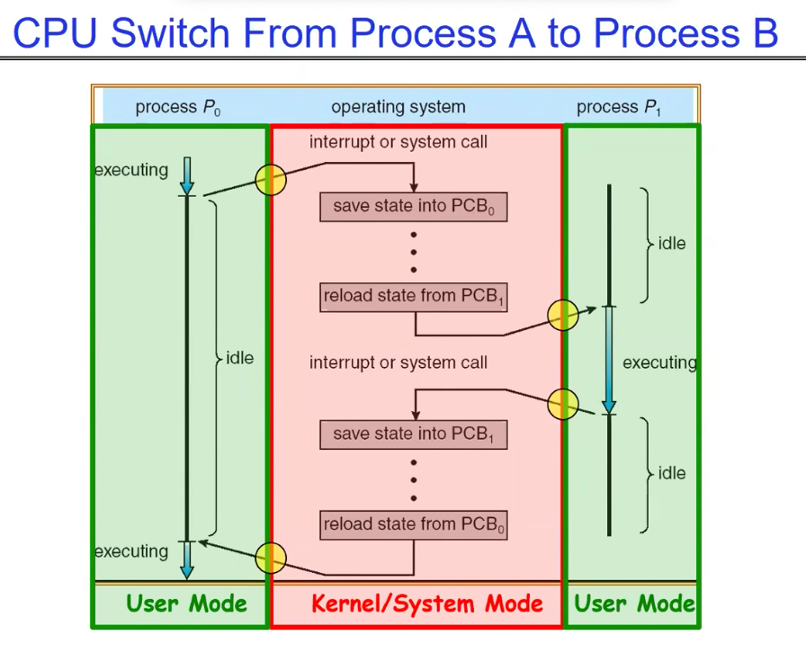
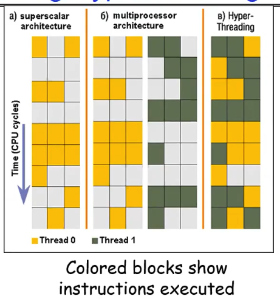
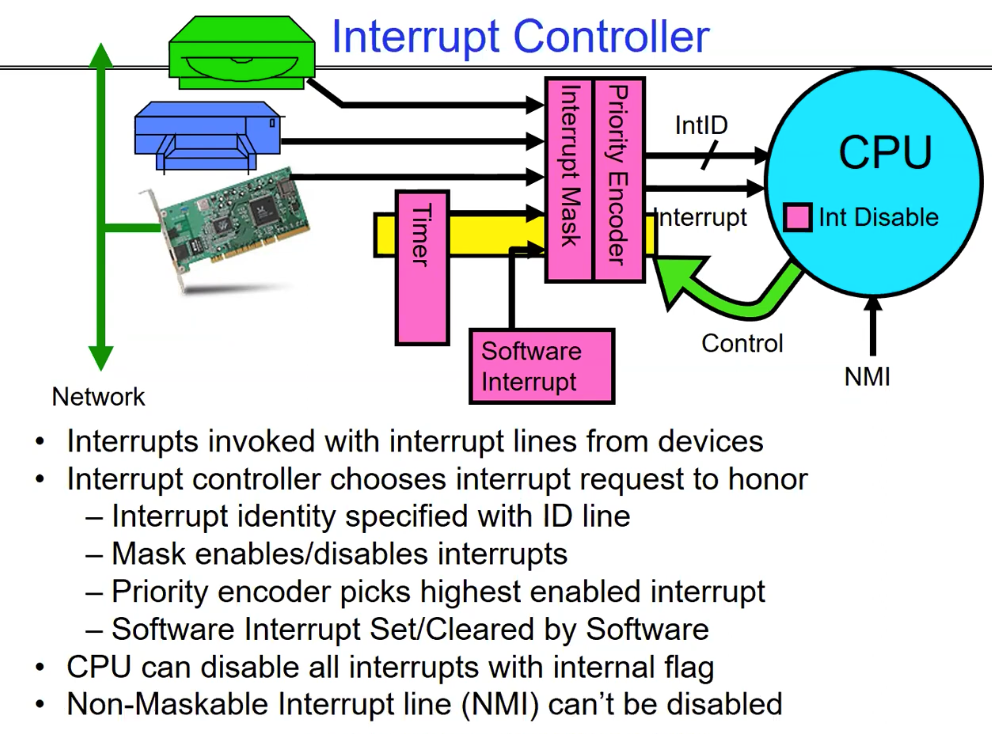

- How do we represent user processes in the OS?
- How do we decide which user process to run?
- How do we pack up the process and set it aside?
- How do wet get a stack and heap for kernel?
- Aren't we wasting are lot of memory?

----
### PCB(process control block)
- Kernel represents each process as a PCB(status, register state , pid, execution time ,mem space ...)
- Kernel Scheduler: mechanism for deciding which processes/threads receive the CPU.Also have lots of schdduling policies provide like: Fairness, Realtime guarantees, Latency optimizaion

### Simulatneous MulitiThreading/Hyperthreading(并发多线程/超线程)
- superscalar architectures（超标量架构）:传统的 CPU 可以在一个时钟周期执行多条指令，但这些指令必须来自同一个线程。如果线程指令之间有依赖关系，CPU 就会留下很多空位（黄色方块代表执行，灰色代表空闲） 
- hyperthreading(超线程): 硬件通过复制一份寄存器状态（Register State），让操作系统认为有两个“逻辑 CPU”。这样，CPU 就可以把两个不同线程的指令塞进同一个时钟周期里（黄色和绿色方块并存），大幅提高了硬件利用率。

### 比 `base-bound`更好的内存上下文管理策略：x86 - segments and stacks / address mapping
- segments and stacks: x86 架构提供了一个叫做段寄存器（Segment Register）的机制，可以让操作系统为每个进程分配不同的内存段（Segment）。每个段都有一个基址（Base Address）和一个界限（Limit），操作系统通过修改段寄存器来切换不同进程的内存上下文。
- address mapping: 现代操作系统通常使用虚拟内存（Virtual Memory）机制，每个进程都有自己的虚拟地址空间。操作系统通过页表（Page Table）将虚拟地址映射到物理地址，这样每个进程就可以独立地使用内存，而不必担心其他进程的内存访问。这种方式比基于段寄存器的方式更灵活和高效。

### 3 types of Kernel Mode Transfer
1. Syscall: 进程管理，文件io, 内存管理， 网络与通信，设备与信息维护
2. Interrupt: External asynchronous event triggers context switch __force the system to go forom user mode into the kernel to handle issues, independent of user process__
3. Trap or Exception: internal synchronous event in process triggers context switch,通常用于处理错误或异常情况，比如除零错误、非法指令等。当发生trap时，CPU会自动切换到内核模式，并跳转到相应的异常处理程序来处理这个事件。

### Interrupt Control
- 中断过程user process进程不可见
    - Occurs between instrucitons, restarted transparently(means the user process doesn't know an interrupt happened, it just continues executing as if nothing happened)
    - no change to process state
- Interrupt Handler(ISR) invoked with interrupts `disable`
    - interrupt handle 不属于任何进程
    - 在任务完成后重启
    - 典型的处理流程：硬件自动保存(cpu将当前的pc,flags压入kernel stack) -> prologue(存相关的register) -> 执行任务 -> epliogue -> iret(同时恢复PC和切换CPU模式)
    __Pack up a queue and pass off to an OS thread to do the work, then restart the interrupted process.__
    - Non-maskable interrupt(NMI): 不能被屏蔽的中断，通常用于处理紧急情况，比如硬件故障等。

    

### interrupts safety
- Interrupt vector: limited number of entry points into kernel
- kernel interrupt stack: handler works regardless of state of user code
- Interrupt masking: handle is non-blocking(non-blocking means: the handler will not wait for any resource to become available, it will just execute and then return)
- Atomic transfer of control(原子控制转移): 指在处理中断时，CPU会自动保存当前的状态（包括程序计数器、寄存器等），并切换到内核模式执行中断处理程序。这个过程是原子的，意味着在切换过程中不会被其他中断打断，确保了中断处理的完整性和安全性。
- Transparent restartable execution(透明可重启执行): 当中断处理完成后，CPU会自动恢复之前保存的状态，并继续执行被中断的用户进程，就好像中断从未发生过一样。这种机制确保了用户进程的连续性和稳定性。  

### [[separate kernel stacks]]
- Two-stack model:
  - OS thread has interrupt stack + user stack
  - Syscall handler copies user args to kernel space before invoking specific function(意思是在处理系统调用时，内核会将用户空间的参数复制到内核空间，以确保安全性和隔离性。这样，即使用户空间的参数被修改，也不会影响内核空间的执行。)

### [[kernel System Call Handler]]
- vector through well-defined syscall entry points
- localte arguments: in registers or on user stack
- copy arguments: from user mem into kernel mem
- validate arguments: protect kernel from errors in user code
- copy results back: into user mem

### [[Creating Processes]]
- pid_t fork() - create a copy of the current process, return 0 to child and pid to parent
    - when return value > 0: parent process, return child's pid
    - when return value == 0: running in new Child process
    - when return value < 0: error   
- state of original process duplicated in both Parent and child